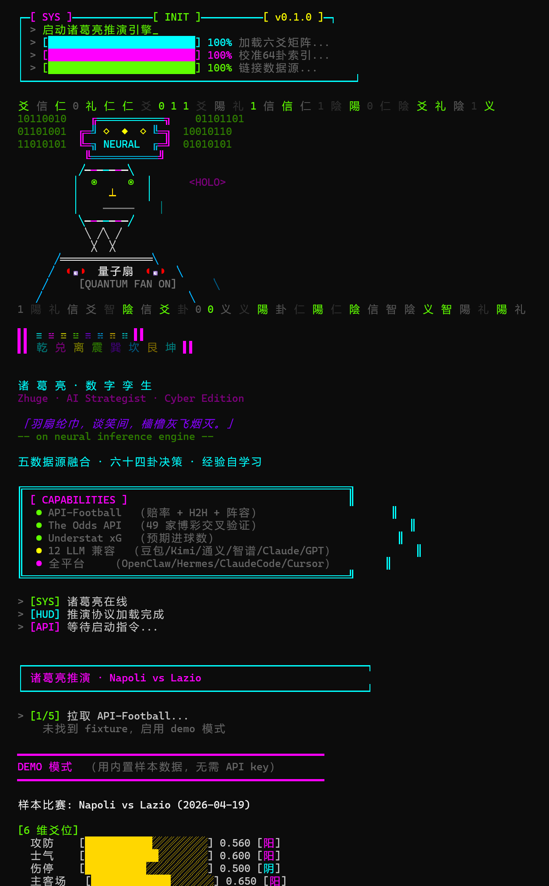

<p align="center">
  
</p>

# 🎴 诸葛亮 · AI 推演军师

**中文** · [English](README.en.md)

> **羽扇纶巾，谈笑间，樯橹灰飞烟灭** — 给 AI Agent 一支量子羽扇
>
> 整合 **API-Football / The Odds API / Understat xG** 等 5 大数据源，以 **6 维爻位 + 64 卦决策树**做结构化推演 —— **0 token 做预测**，LLM 只在你明确要"孔明评语"时才调用（省 90% token）。支持 **DeepSeek / Kimi / 通义 / 智谱 / Claude / GPT / Gemini** 等 12 家 LLM。

[](https://www.python.org/)
[](https://github.com/yangfei222666-9/zhuge-skill/actions/workflows/ci.yml)
[](LICENSE)
[](https://github.com/NousResearch/hermes-agent)
[](https://xiaping.coze.site/)

<p align="center">
  
</p>

<p align="center">
  <em>一句话 <code>predict "Napoli vs Lazio"</code> → 量子扇开启 → 5 大数据源融合 → 6 维爻位评分 → 64 卦决策。</em>
</p>

---

## ⚡ 30 秒上手

```bash
# 1. 克隆 / 解压
git clone <repo>  # 或 unzip zhuge-skill.zip
cd zhuge-skill

# 2. 装依赖 (只 2 个: requests + python-dotenv)
pip install -r requirements.txt

# 3. 复制配置模板 → 填 key
cp .env.example .env   # Windows: copy .env.example .env
# 编辑 .env 至少填 2 行:
#   LLM_PROVIDER=deepseek     ← 必须! 不写这行 LLM 静默不调用 (坑 #15)
#   DEEPSEEK_API_KEY=<你的key> ← 去 platform.deepseek.com 领, ¥5 免费够跑几千次

# 4. Windows 用户必设 (否则 ⚠ 字符崩)
set PYTHONIOENCODING=utf-8   # cmd; PowerShell: $env:PYTHONIOENCODING='utf-8'

# 5. 一键启动
python start.py
```

**就这样**. `start.py` 会自动: 播放赛博诸葛亮欢迎动画 / 检查依赖 / 引导配置 / 跑 demo.

> ⚠️ **两个新手坑 (2026-04-18 晚朋友踩过 · 已在 .env.example 标记)**:
> 1. `LLM_PROVIDER` 必须写 · 只填 `*_API_KEY` 不够, LLM 不会调用
> 2. Windows cmd 需 `PYTHONIOENCODING=utf-8`, 否则遇 `⚠` 等字符抛 UnicodeEncodeError

---

## ✨ 核心特性

### 🎯 真·会自学习
不是「号称」会学，而是真的有完整闭环：

```
预测 → 写经验库 → 等结果 → 自动回传 → 计算命中率
                                      ↓
共同进化 ← 推/拉晶体 ← 提炼成功模式 ← 校准爻位权重
```

### 💎 经验结晶 + 共同进化（杀手级）
- **结晶**：当某个卦象 + 爻位组合连续命中 N 次，自动提炼为「晶体」
- **共享**：你的晶体可以推到共享池，下次别人预测时可能用到你的
- **集体智能**：所有用户的晶体形成集体经验池，**用得越多越准**

### 🔌 5 数据源融合
| 数据源 | 角色 | 是否需付费 |
|--------|------|-----------|
| API-Football | 单家深度赔率 + H2H + 阵容 | 免费 100/日 |
| The Odds API | 49 家博彩交叉验证 | 免费 500/月 |
| Understat | xG / xGA 预期进球 | 完全免费（爬虫）|
| 64 卦表 | 决策推演引擎 | 内置 |
| 经验库 | 自学习数据 | 内置 12 条种子 |

### 🌍 12 云商 + 🏠 本地 Ollama（零成本）

豆包 / Kimi / 通义千问 / 智谱 GLM / Yi / 百川 / MiniMax / DeepSeek / OpenAI / Claude / Gemini / 中转 —— 外加**本地 Ollama**（免费跑开源 LLM）。

一行配置切换：
```bash
LLM_PROVIDER=doubao  # 改成 kimi / qwen / claude / 任何
```

#### 三档落地 · 从零成本到满血

| Tier | 需要 | 得到什么 | 合适谁 |
| --- | --- | --- | --- |
| **0 · 零配置** | 只有 Python | 六爻 + 卦象 + 模板评语（DEMO 模式） | 先看效果的围观党 |
| **1 · 本地 LLM** | 装 [Ollama](https://ollama.com/) + 拉开源模型 | + 孔明亲笔古文评（完全免费） | 不想给云厂商付费/递 prompt 的人 |
| **2 · 满血** | 加 API-Football key | + 真实赔率/阵容/H2H 数据 | 认真做预测 |

**Tier 1 · 本地 Qwen 7B 三行启动**（实测 10/10 通过，p50 ~12s/场）：

```bash
ollama pull qwen2.5:7b                                        # 4.7 GB，一次性
export LLM_PROVIDER=openai \
       OPENAI_API_BASE=http://localhost:11434/v1 \
       OPENAI_API_KEY=ollama \
       OPENAI_MODEL=qwen2.5:7b
python start.py predict "Napoli vs Lazio"                     # 孔明亲笔走本地 Qwen 推理
```

> Ollama 暴露 OpenAI 兼容端点，所以复用 `LLM_PROVIDER=openai` 即可，不用改代码。想换模型直接 `OPENAI_MODEL=qwen2.5:3b` 或 `llama3.2` 任意 Ollama 模型。

### 🎮 全平台兼容
| 平台 | 安装路径 |
|------|----------|
| Hermes Agent (爱马仕) | `~/.hermes/skills/zhuge/` |
| OpenClaw | `~/.openclaw/skills/zhuge/` |
| Claude Code | `~/.claude/skills/zhuge/` |
| Cursor | `.cursor/rules/zhuge.mdc` |
| 任何 Python 环境 | 直接 `python start.py` |

#### 接入片段（复制即用）

<details>
<summary><b>Claude Code</b></summary>

```bash
# 1. 安装到 Claude 的 skills 目录
git clone https://github.com/yangfei222666-9/zhuge-skill.git ~/.claude/skills/zhuge-skill
cd ~/.claude/skills/zhuge-skill && pip install -r requirements.txt

# 2. 在任何 Claude Code 会话里用自然语言调用
# 示例 prompt:
#   用诸葛亮 skill 预测 Napoli vs Lazio
#   跑一下 zhuge-skill 的守护模式，每 30 分钟回传赛后结果
```

Claude Code 会自动读取 `SKILL.md` 的 frontmatter 做技能发现，不需要手动注册。
</details>

<details>
<summary><b>Cursor</b></summary>

在项目根目录建 `.cursor/rules/zhuge.mdc`：

```mdc
---
description: 足球预测 + 易经推演（zhuge-skill）
globs: **/*
alwaysApply: false
---
当用户要预测比赛或做结构化决策时，可用 zhuge-skill：

  python /path/to/zhuge-skill/start.py predict "Home vs Away"

会输出 6 维爻位评分 + 64 卦决策 + 命中晶体（如有）。
skill 本地运行，0 token 做结构化推演，LLM 只在生成孔明评语时调用。
```
</details>

<details>
<summary><b>OpenClaw</b></summary>

```bash
# 方法一：clawdhub / clawhub 同步（如果你已装）
clawhub install zhuge-skill

# 方法二：手动拷贝
git clone https://github.com/yangfei222666-9/zhuge-skill.git ~/.openclaw/skills/zhuge-skill
```

OpenClaw 启动时会自动扫描 `~/.openclaw/skills/` 下所有带 `SKILL.md` 前置 frontmatter 的目录，把 description 注入到 workspace 上下文。
</details>

<details>
<summary><b>Hermes Agent</b></summary>

```bash
git clone https://github.com/yangfei222666-9/zhuge-skill.git ~/.hermes/skills/zhuge
cd ~/.hermes/skills/zhuge && pip install -r requirements.txt
```

Hermes 按 skill 目录 + `SKILL.md` 的标准结构发现，无需额外配置。具体激活细节参考 [Hermes 官方文档](https://github.com/NousResearch/hermes-agent)。
</details>

<details>
<summary><b>纯 Python / 脚本化调用</b></summary>

```bash
# 作为 CLI 工具，不依赖任何 agent 宿主
git clone https://github.com/yangfei222666-9/zhuge-skill.git
cd zhuge-skill && pip install -r requirements.txt
python start.py predict "Napoli vs Lazio"
```

也可以在自己的 Python 代码里导入：

```python
from scripts.predict import predict_match
record = predict_match("Napoli vs Lazio")
print(record["hexagram_name"], record["yang_count"], record["predictions"])
# record 同时会被追加到 data/experience.jsonl 供回传统计用
```
</details>

---

## 🚀 命令速查

```bash
python start.py                                # 引导式启动（首次推荐）
python start.py demo                           # 不需配置直接看 demo
python start.py predict "Napoli vs Lazio"      # 真实预测
python scripts/batch.py "A vs B" "C vs D"      # 批量
python scripts/backfill.py                     # 回传赛后结果
python scripts/backfill.py --loop 30           # 守护模式（每 30 分钟自动回传）
python scripts/stats.py                        # 命中率全景
python scripts/calibrate.py                    # 权重校准建议
python scripts/calibrate.py --apply            # 应用新权重
python scripts/crystallize.py                  # 提炼经验晶体
python scripts/crystallize.py --share          # 提炼后推送到共享池
python scripts/sync.py status                  # 查看晶体池
python scripts/sync.py auto                    # 完整闭环（结晶+推+拉）
python scripts/report.py --days 7 --llm        # LLM 写古风周报
python scripts/share.py --hits                 # 导出命中预测（炫战绩）
```

---

## 🎴 输出示例

```
  ╔══════════════ 推演结果 ══════════════╗
  ║  卦象: 履  (111011)  阳5/6
  ║  含义: 攻防士气主场交锋优，伤停劣
  ║  判语: 谨慎前行，避免因减员受挫
  ║
  ║  孔明评: 履卦五阳临尊，全维度优势，可重仓主胜
  ║
  ║  推荐:
  ║    1X2: home  (信心: 高)
  ║    2.5: under  (近期场均 1.6 球)
  ║
  ║  ✦ 触发晶体 [xtl-a3f9b2] 1x2=home
  ║    历史命中率 83% (10/12)
  ╚════════════════════════════════════════╝
```

---

## 📂 文件结构

```
zhuge-skill/
├── start.py              ← 一键入口（带欢迎动画）
├── README.md / SKILL.md  ← 文档
├── requirements.txt
├── .env.example          ← 12 LLM + 3 数据源配置模板
├── core/                 ← 框架无关的算法
│   ├── welcome.py        ← 赛博诸葛亮 ANSI 动画
│   ├── wizard.py         ← 引导式安装
│   ├── hexagram.py       ← 64 卦推演
│   ├── yao.py            ← 6 维爻位
│   ├── kongming.py       ← 孔明决策层
│   ├── llm.py            ← 12 LLM 统一适配
│   └── crystallizer.py   ← 经验结晶
├── adapters/             ← 数据源
│   ├── api_football.py
│   ├── the_odds.py
│   └── understat.py
├── scripts/              ← 入口
│   ├── predict.py        ← 单场预测
│   ├── batch.py          ← 批量
│   ├── backfill.py       ← 回传 (--loop 守护模式)
│   ├── stats.py          ← 命中率
│   ├── calibrate.py      ← 校准权重
│   ├── crystallize.py    ← 结晶
│   ├── sync.py           ← 共同进化
│   ├── report.py         ← 周报
│   └── share.py          ← 导出
└── data/
    ├── hexagram_64.json          ← 64 卦表
    ├── seed_experience.jsonl     ← 12 条种子经验
    ├── experience.jsonl          ← 用户预测库（运行时生成）
    ├── crystals_local.jsonl      ← 本地晶体
    └── crystals_shared.jsonl     ← 共享晶体（从云端拉）
```

---

## 🔧 配置详解

详见 `.env.example`。三种配置方式都支持：

```bash
# 方式 A: .env 文件
echo "API_FOOTBALL_KEY=xxx" >> .env

# 方式 B: 环境变量
export API_FOOTBALL_KEY=xxx

# 方式 C: Skill 调用时不需要任何配置（用 demo 模式）
python start.py demo
```

---

## 🧙 关于「孔明评语」

每次预测，可选让 LLM 用诸葛亮古风文言写一段战前推演：

```
（曹操vs刘备 · 赤壁卦 · 阳3阴3）

吾观此战，水军未练而北人不习战，曹氏虽众，疾疫已起；
孙刘合力，黄盖献策，火攻可成。然变数在风—东南风若至，
则樯橹灰飞；若西北风转，则反受其害。建议轻仓试探，
观风向再追加。
```

支持 12 个 LLM 供应商，按需切换。

---

## 🌐 共同进化机制

每次预测命中后，系统会自动：
1. 检测「卦象 + 爻位组合」是否形成稳定模式
2. 累积 ≥3 场且命中率 ≥60% → 提炼为晶体
3. （可选）推送到共享池（GitHub Release）
4. 拉取其他 Agent 贡献的晶体

**结果**：你今天用的可能是别人昨天结晶的智慧。

---

## 📜 License

MIT — 自由使用、修改、商用。

---

## 🙏 致谢

- TaijiOS 项目 (https://pypi.org/project/taijios-soul/) — 灵魂引擎来源
- API-Football / The Odds API / Understat — 数据源
- Hermes Agent / OpenClaw — Agent 平台
- 周易、三国演义 — 千年智慧

---

## 📬 反馈与联系

装上了？跑不起来？有想法想聊？请走公开 issue，避免私下联系方式散落在文档里：

- GitHub Issue: [提 issue](https://github.com/yangfei222666-9/zhuge-skill/issues/new)

这是早期项目，你的每一条反馈（哪怕是"装了跑不起来"）都会被认真看。
